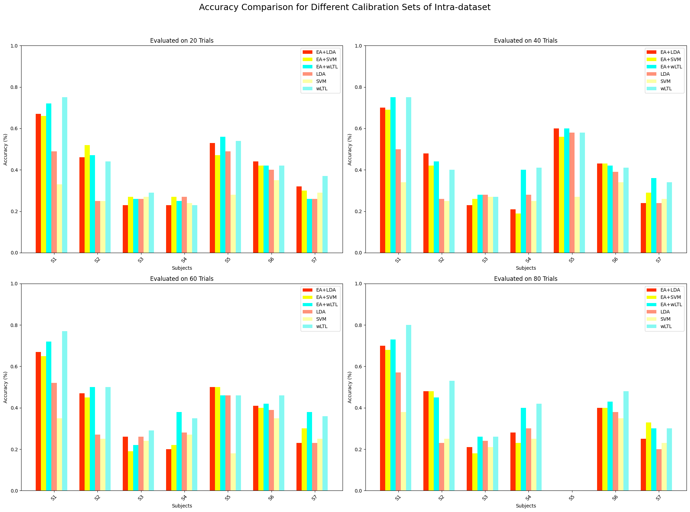
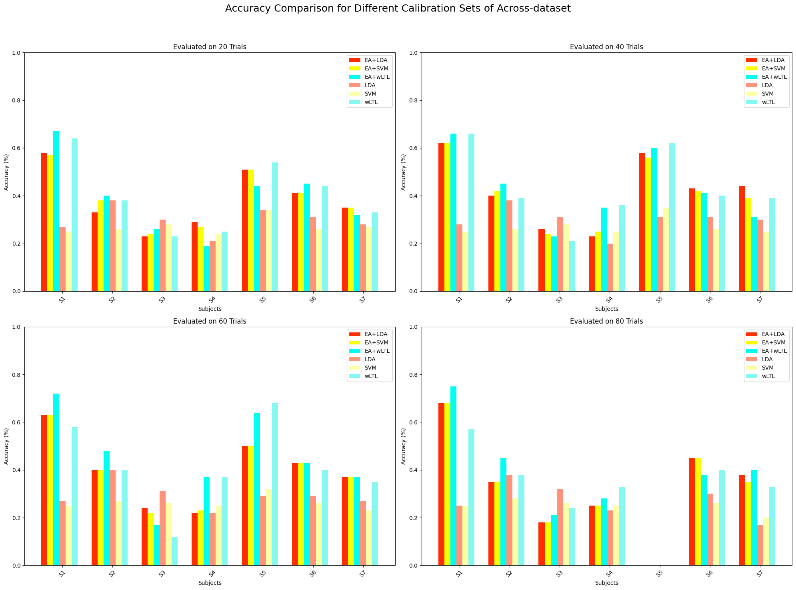

# Motor Imagery Transfer Learning Study (In progress)

This study aims to investigate the possibility of conducting short-time motor imagery calibration using transfer learning. Euclidean Alignment (EA)[1] and Weight Logistic Regression-Based Learning (wLTL)[2] will be applied for transfer learning with 4 classes of motor imagery.     

**Target Domain Dataset**
1. Unicorn Hybrid Black: The motor imagery data from 7 participants recorded from my [undergraduate thesis](https://suparach3.wordpress.com/blog/), contain 120 trials per subject, 30 trials per class (Left hand, Right hand, Both Feet and Non-imagine).

**Source Domain Dataset**
1. [Physionet](https://archive.physionet.org/pn4/eegmmidb/): The Motor Imagery data from 109 participants of Left hand, Right hand, Both feet and Rest as Non-imagine from this dataset, contain 25 trials per class for each subject (counter-balance for Non-imagine class).
2. [BCI competition IV 2a](https://www.bbci.de/competition/iv/): Contain 4 classes of Left hand, Right hand, Feet and Tongue motor imagery, 9 participants tasked to perform motor imagery 72 trials per class (all sessions) 

I selected EEG channels Fz, C3, Cz, C4, and Pz for transfer learning implementation for all datasets. 

# Intra-dataset Result
[UnicornDataAlignment.ipynb]
The Unicorn Hybrid Black dataset was used, with data separated into source and target domains. In this approach, each subject was selected as the target domain, while the remaining subjects were used as the source domain. For the target domain, a subset of trials was selected as calibration sets for the EA and wLTL methods.

*note data of S5 is only 80 trials because noisy epoch removal

# Across-dataset Result
[00TF_acrossdataset.ipynb]
The Physionet and BCI Competition IV 2a datasets were used as the source domain, while each participant from the Unicorn Hybrid Black dataset was used as the target domain. Similar to the inter-dataset approach, a subset of trials was selected as calibration sets for the EA and wLTL methods in the target domain.

*note data of S5 is only 80 trials because noisy epoch removal

# Reference 
1. He, H., & Wu, D. (2020). Transfer Learning for Brain-Computer Interfaces: A Euclidean Space Data Alignment Approach. IEEE Transactions on Biomedical Engineering, 67(2), 399–410. https://doi.org/10.1109/TBME.2019.2913914
2. Azab, A. M., Mihaylova, L., Ang, K. K., & Arvaneh, M. (2019). Weighted Transfer Learning for Improving Motor Imagery-Based Brain-Computer Interface. IEEE Transactions on Neural Systems and Rehabilitation Engineering, 27(7), 1352–1359. https://doi.org/10.1109/TNSRE.2019.2923315
3. Li, M., Xu, D. Transfer Learning in Motor Imagery Brain Computer Interface: A Review. J. Shanghai Jiaotong Univ. (Sci.) 29, 37–59 (2024). https://doi.org/10.1007/s12204-022-2488-4

# Special Thank
1. [orvindemsy/EA-wLTL](https://github.com/orvindemsy/EA-wLTL/tree/master): For the coding guildline.
